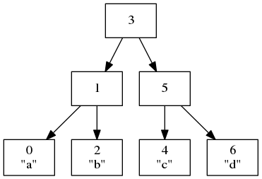
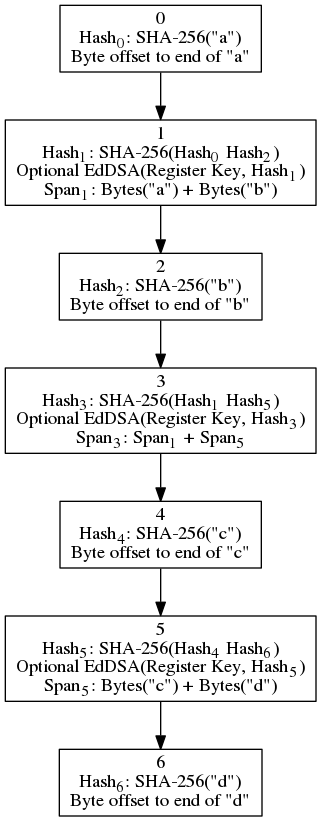

# SLEEP Data Format

### Syncable Lightweight Event Emitting Persistence
### Version 2.0

SLEEP is a metadata format that allows a set of files to be accessed randomly, cryptographically verified, and dynamically updated. A SLEEP file contains content addressed file metadata in a representation specifically designed to allow partial streaming access to individual chunks of data. SLEEP files can be shared as a single downloadable file for easy distribution and we also specify a way to expose SLEEP over REST.

The SLEEP format can be used in a similar way to how MD5 checksums are used over HTTP today, to verify the integrity of data downloads. Whereas MD5 or SHA are usually checksums of the whole data set, meaning consumers have to download the entire all available data before they are able to verify the integrity of any of it, SLEEP allows a set of data to be split in to many small pieces, each one getting it's own cryptographically secure checksum. This allows consumers to download subsets of data and metadata, in whatever order they prefer, and verify the integrity of each piece of data as it is accessed. SLEEP files may also include cryptographic signatures too allow users to verify that data they received was created using a holder of a specific private key.

## Registers

SLEEP is designed around the concept of a register, an append only list that you can trust. The contents of a register are cryptographically fingerprinted and an aggregate checksum can be used to verify the contents of the register have not been tampered with. There are various ways to calculate these aggregate checksums but the data in a register is a binary append only feed, e.g. an list of buffers that can only be updated by placing new buffers at the end of the list.

SLEEP also provides an index that allows each piece of data in a register to be accessed randomly. In order to look up a specific piece of data in the register, you only need a small subset of the metadata in order to find it, making SLEEP suitable for live streaming or sparse download use cases.

The register index is a Merkle tree where the leaf nodes are the hashes of the buffers in the register, and the rest of the nodes in the tree are derived Merkle hashes. A Merkle tree is defined as a tree where leaf nodes are a hash of some piece of data, and the rest of the nodes are the result of a hash of the concatenation of that nodes children.

So, given a register with four values:

```
1. a
2. b
3. c
4. d
```

To construct the register itself you concatenate all buffers, in this case resulting in 'abcd'.

The register index is constructed by creating a Merkle tree where the leaf nodes are the hash of our four values, and the rest of the nodes are the hash of the nodes two children hashes concatenated together.


To be able to refer to a specific node in the tree we use an in-order node traversal to assign integers to the nodes:



In-order node numbering has the property with our trees that leaf nodes are always even and non-leaf nodes are always odd. This can be used as a quick way to identify whether a node is a leaf or not.

Every serialized node in the tree is one of two fixed widths, leaf nodes are all the same size and non-leaf nodes are the same size. When serializing the tree you simply write the nodes in order and concatenate them. Then to access a node by its in-order position you simply multiply the node length by the position to get the byte offset.

All leaf nodes contain these two pieces of information:

- The sha256 hash of the data described by this node
- The absolute byte offset to the end of the region of data described by the node

All non-leaf nodes contain these three pieces of information:

- The sha256 hash of the concatenation of the two children hashes
- The cryptographic signature of the hash
- The span of bytes that the nodes children cover


When initializing a register an asymmetric Ed25519 key pair is derived. The private key is never shared. The public key is used as the URL for the register. When signing hashes in the tree the public key is used to generate an EdDSA signature. For the example register above, 'abcd', the register index (in pseudocode) would be:

```js
var keys = {
  public: 'cc0cf6eeb82ca946ca60265ce0863fb2b3e3075ae25cba14d162ef20e3f9f223',
  private: '87399f90815db81e687efe4fd9fc60af336f4d9ae560fda106f94cb7a92a8804cc0cf6eeb82ca946ca60265ce0863fb2b3e3075ae25cba14d162ef20e3f9f223'
}

var index = {
  // sha256 of children[0].hash + children[1].hash
  hash: '0440c655d63fec5c02cffd5d9b42d146aca03b255102b9b44b51c6a919b31351',
  signature: '1713dfbaf4a7f288003394b72ec486aa4fa1a837aa0b08662b3a14b63381b84c2e6965e2638fb5375ae2e92b47c2ab8718ec1914778518fcb3c0563eb2c09604',
  span: 4,
  children: [
    {
      // echo -n "$(echo -n "a" | shasum -a 256)$(echo -n "b" | shasum -a 256)" | shasum -a 256
      hash: '9ad4d5608a7a40db60c35f255fad821b762a82de168b4f4ed477d5d899b11796',
      signature: '2714b99e305ce46aa6d24eb2888cf0cbde33ad4a8bcd08705b59882837bf1e482f8dcab2ae94c2359914b1fe92831bfc73af99f1c6b1f5eba47efc4efa32de0d',
      span: 2,
      children: [
        {
          // echo -n "a" | shasum -a 256
          hash: 'ca978112ca1bbdcafac231b39a23dc4da786eff8147c4e72b9807785afee48bb',
          endByte: 1
        },
        {
          // echo -n "b" | shasum -a 256
          hash: '3e23e8160039594a33894f6564e1b1348bbd7a0088d42c4acb73eeaed59c009d',
          endByte: 2
        }
      ]
    },
    {
      // echo -n "$(echo -n "c" | shasum -a 256)$(echo -n "d" | shasum -a 256)" | shasum -a 256
      hash: '09114d1a8a78b5d091e492c524ad7f8e941f403db0a6d3d52d36f17b9a86ce1c',
      signature: '6ac5e25206f69f22612e9b58c14f9ae6738233a57ab7f6e10c1384c4e074f6c8c606edbd95a9c099a0120947866079e3d13ef66dd7d5ed1756a89a5e9032a20d',
      span: 2,
      children: [
        {
          // echo -n "c" | shasum -a 256
          hash: '2e7d2c03a9507ae265ecf5b5356885a53393a2029d241394997265a1a25aefc6',
          endByte: 3
        },
        {
          // echo -n "d" | shasum -a 256
          hash: '18ac3e7343f016890c510e93f935261169d9e3f565436429830faf0934f4f8e4',
          endByte: 4
        }
      ]
    }
  ]
}
```

The above representation of the tree is in hierarchical object notation. However due to the properties of the in-order node indexes we can represent the same data in a flat index while still allowing traversals.



# File Format

SLEEP files should be named `sleep.dat` and have the following format:

```
<Header><Register Index...><Register Data...>
```

The format is a header followed by the register index. Order of the index is determined by an in-order node traversal. After the register index, the actual register entry data follows. The header length is variable width, prefixed with a varint. The Register Index is composed of fixed width metadata entries. The Register Data is composed of concatenated variable-width data pieces.

### Header Format

```
<varint header-length><header protobuf>
```

The header protobuf has this schema:

``` protobuf
message Header {
  required bytes datLink = 1;
  required uint64 entryCount = 2;
  optional bool isSigned = 3;
  optional string hashType = 4 [default = "sha256"];
  optional uint32 hashLength = 5 [default = 32];
  optional string signatureType = 6 [default = "ed25519"];
  optional uint32 signatureLength = 7 [default = 64];
}
```

### Register Index Format

For non-signed even (leaf) nodes:

```
<8-byte-span-length><data-hash>
```

The 8-byte-span-length is an unsigned big-endian 64 bit integer that should be number of cumulative bytes encompassed by all of the leaf nodes underneath the current node.

For signed even (leaf) nodes:

```
<8-byte-span-length><data-hash-signature><data-hash>
```

For odd (non-leaf) nodes:

```
<8-byte-end-offset><data-hash>
```

The 8-byte-end-offset is an unsigned big-endian 64 bit integer that should be the absolute position in the file for the **end** of the piece data described by this node.

### Register Data

The last section of the file is the actual data pieces, unmodified and concatenated together in sequential order.

For the example tree above, the Register Data section would simply be `abcd`.

## Example

Given a tree like this you might want to look up in a `meta.dat` file the metadata for a specific node:

```
0─┐  
  1─┐
2─┘ │
    3
4─┐ │
  5─┘
6─┘
```

If you wanted to look up the metadata for 3, you could read the third (or any!) entry from meta.dat:

First you have to read the varint at the beginning of the file so you know how big the header is:

``` js
var varint = require('varint') // https://github.com/chrisdickinson/varint
var headerLength = varint.decode(firstChunkOfFile)
```

Now you can read the header from the file

``` js
var headerOffset = varint.encodingLength(headerLength)
var headerEndOffset = headerOffset + headerLength
var headerBytes = firstChunkOfFile.slice(headerOffset, headerEndOffset)
```

To decode the header use the protobuf schema. We can use the [protocol-buffers](https://github.com/mafintosh/protocol-buffers) module to do that.

``` js
var messages = require('protocol-buffers')(fs.readFileSync('meta.dat.proto'))
var header = messages.Header.decode(headerBytes)
```

Now we have all the configuration required to calculate an entry offset.

``` js
var entryNumber = 42
var entryOffset = headerEndOffset + entryNumber * (8 + header.hashLength)
```

If you have a signed feed, you have to take into account the extra space required for the signatures in the even nodes.

``` js
var entryOffset = headerLength + entryNumber * (8 + header.hashLength)
                  + Math.floor(entryNumber / 2) * header.signatureLength
```
